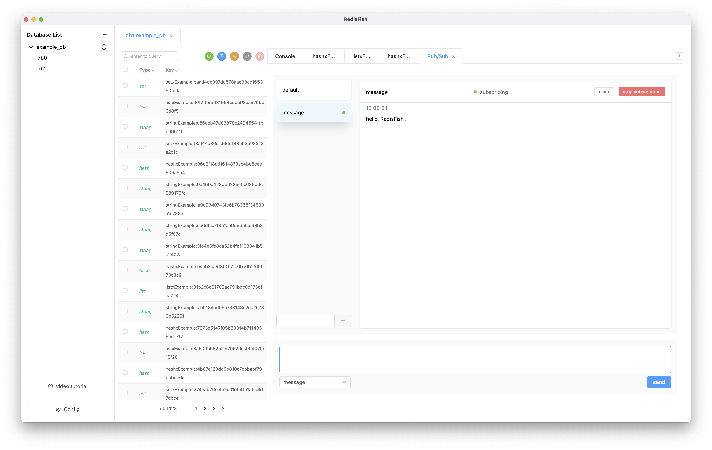
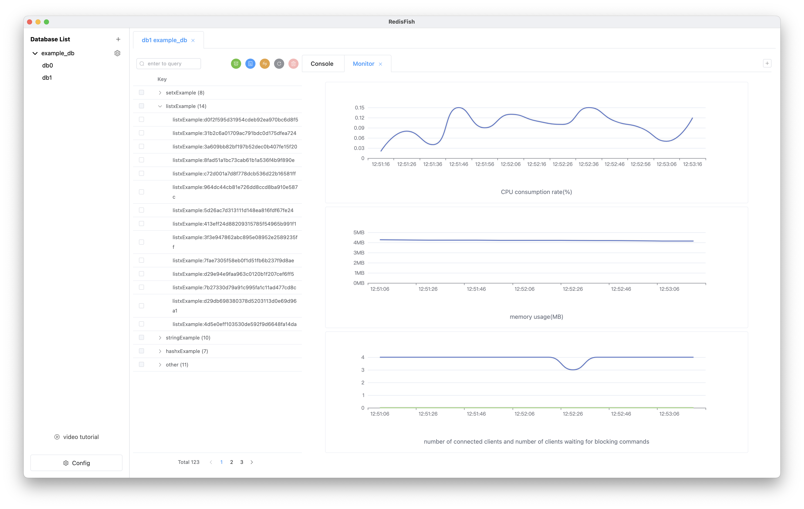

<h3 align="center">RedisFish</h3>

  
  
  

## Info

`RedisFish` is a convenient, cross-platform, data-focused Redis GUI client🌈🌈🌈. Maybe you will like it.

Since `v 1.0.0`, I have received a lot of useful feedback from friends, thank you very much!

> Formerly RedFish, renamed due to the same name

language: [简体中文](https://github.com/Kuari/RedisFish/blob/main/README.zh-CN.md) English

download: [releases](https://github.com/Kuari/RedisFish/releases)

## Features

* Redis basic type data processing
* The status of data processing is distinguished by color. For example, in hash type data, blue represents new data, yellow represents edited data, etc.
* Data multi-selection processing
* The data in the table can be edited directly by `double-clicking`, or it can be enlarged by the shortcut key of `right-click`
* JSON auto format
* JSON viewing and editing
* key list paging query
* The key list can be filtered by prefix grouping, support`:`, `-`, `_`, `#`, `=`, `+`, select in settings
* The key list supports two different modes: the list is displayed directly and classified into folders according to the prefix, which can be switched in the settings.
* The console supports two different modes: single command execution and multi-command execution at the same time
* Support log function, view execution command log
* Database monitoring, supports cpu usage, memory usage, number of connected clients, number of clients waiting for blocking commands
* Graphical operation of publish/subscribe function
* TLS
* Dark mode
* Multi-language support, support Chinese, English, automatically switch according to the system
* Automatic update (currently only on mac)

## HotKey

* **Copy**: `Command/Ctrl` + `left-click` shortcut copy
* **Data Zoom**: `Right-click` the data to open the data zoom editor, including text and json modes, can be automatically recognized

## Screenshot

