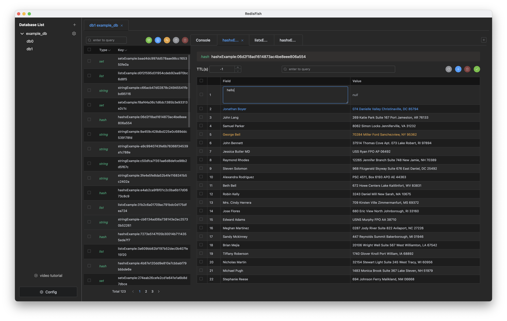

<h3 align="center">RedFish</h3>

## Info

`RedFish` is a convenient, cross-platform, data-focused Redis GUI client. I added some (think) fantastic ideas as much as I could, like right-clicking to zoom in on the data and editable features, and taking advice from more senior developers to improve it. Since `Beta 1.0.0`, after several months of intermittent development, many areas have been optimized, and even some functions include different processing methods, which can adapt to different operating habits, hoping to bring a better experience. Thanks to every user, if you have any feedback, I hope you can let me know.

language: [简体中文](https://github.com/Kuari/RedFish/blob/main/README.zh-CN.md) 英文

download: [releases](https://github.com/Kuari/RedFish/releases)

## Features

* Redis basic type data processing
* The status of data processing is distinguished by color. For example, in hash type data, blue represents new data, yellow represents edited data, etc.
* Data multi-selection processing
* The data in the table can be edited directly by double-clicking, or it can be enlarged by the shortcut key of `right-click`
* JSON auto format
* JSON viewing and editing
* key list paging query
* The key list can be filtered by prefix grouping
* The console supports two different modes: single command execution and multi-command execution at the same time
* Support log function, view execution command log
* Database monitoring, supports cpu usage, memory usage, number of connected clients, number of clients waiting for blocking commands
* Graphical operation of publish/subscribe function
* TLS
* Dark mode
* `Command/Windows + left mouse click` shortcut copy
* `Right-click` the data to open the data magnification editor, including text and json modes
* Multi-language support, support Chinese, English, automatically switch according to the system
* Automatic update (currently only on mac)

## Screenshot

